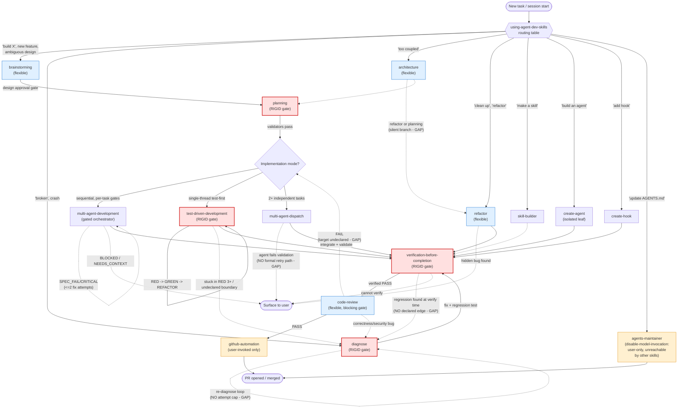

# agent-dev Skills Audit

Full audit of all 16 skills in `C:\agent-dev\skills`, conducted by three specialized agents:

- **skill-reviewer** — per-skill quality, frontmatter, trigger-overlap review
- **workflow-orchestrator** — lifecycle/state-machine modeling and gap analysis
- **multi-agent-coordinator** — coordination-model review of the multi-agent skills

Date: 2026-06-17

---

## 1. Overall Verdict

The skill set is a well-engineered routing ecosystem. Every `SKILL.md` has valid frontmatter, specific trigger phrases, and consistent structure. A single meta-skill, `using-agent-dev-skills`, acts as the router and is the entry point for the whole system. The two largest risks found are not bugs in individual files but **systemic gaps in failure/back-edges**: several gates (`verification-before-completion`, `code-review` FAIL, `diagnose` retry loop) don't declare where control goes when something fails, leaving that judgment call to the orchestrating model every time.

---

## 2. Workflow Diagram

Solid edges = happy path. Dashed edges = conditional/feedback transitions (several marked **GAP** are present in the skill text but lack a concrete target — see §4).

---

## 3. Per-Skill Quality Notes (skill-reviewer)

| Skill                          | Verdict                      | Notes                                                                                                                                                                                                                                      |
| ------------------------------ | ---------------------------- | ------------------------------------------------------------------------------------------------------------------------------------------------------------------------------------------------------------------------------------------ |
| agents-maintainer              | Clean                        | Specific triggers; `disable-model-invocation: true` intentional                                                                                                                                                                            |
| architecture                   | Clean                        | Minor trigger overlap with `refactor`, self-mitigated via Mode A/B interview                                                                                                                                                               |
| brainstorming                  | Clean                        | Explicit skip conditions prevent over-triggering                                                                                                                                                                                           |
| code-review                    | Clean                        | Explicitly scopes out architecture/refactor concerns — good anti-overlap design                                                                                                                                                            |
| create-agent                   | Clean                        | Specific triggers                                                                                                                                                                                                                          |
| create-hook                    | Clean                        | Exemplary decision table disambiguating from skill-builder                                                                                                                                                                                 |
| diagnose                       | Clean                        | Strong "never guess" framing                                                                                                                                                                                                               |
| github-automation              | Clean                        | Niche skill, appropriately gated by `disable-model-invocation`                                                                                                                                                                             |
| multi-agent-development        | Minor overlap, self-resolved | Explicitly distinguishes itself from multi-agent-dispatch                                                                                                                                                                                  |
| multi-agent-dispatch           | Minor overlap, self-resolved | Same as above, mutual cross-reference                                                                                                                                                                                                      |
| planning                       | Clean                        | Explicitly excludes brainstorming-shaped requests                                                                                                                                                                                          |
| refactor                       | Minor overlap                | Broad triggers ("improve", "modernize") could collide with architecture/code-review; lacks an explicit hand-off note (code-review has one, refactor doesn't)                                                                               |
| skill-builder                  | Minor structural defect      | Duplicated trailing lines (copy-paste artifact) — cosmetic, should be cleaned up                                                                                                                                                           |
| test-driven-development        | **Broadest trigger surface** | Description includes very generic phrases ("write a function", "implement this") plus proactive triggering — by design per router, but the description itself doesn't signal the "trivial scripts" carve-out that exists in the skill body |
| using-agent-dev-skills         | Clean                        | All routing-table skill names verified to match real directories                                                                                                                                                                           |
| verification-before-completion | Clean                        | Scenario A/B split avoids redundant re-verification                                                                                                                                                                                        |

---

## 4. Structural Gaps (workflow-orchestrator)

1. **`code-review` FAIL has no deterministic target.** Says "route back to implementation" without naming which skill (TDD? multi-agent-development? diagnose?).
2. **`verification-before-completion` has no failure edge.** If a regression is found at verify time, there's no documented transition into `diagnose` — the most consequential gap, since it's the final gate before "done."
3. **`diagnose`'s re-diagnose loop has no attempt cap**, unlike `multi-agent-development`'s explicit 2-attempt-then-BLOCKED rule. Two interacting bugs could ping-pong indefinitely.
4. **TDD → diagnose handoff is implied, not declared.** "Stuck in RED 3+" reverts/simplifies internally rather than escalating to `diagnose`.
5. **Three different skills partially own the "which implementation mode" decision** (planning's handoff text, multi-agent-development's gate, multi-agent-dispatch's gate) — no single authoritative selector.
6. **`architecture` → refactor vs. planning fork is a silent branch**, not a stated rule.
7. **`refactor`'s Hidden Bug Protocol dead-ends at the user** with no declared edge once the user says "fix it."

### Recommendations

- Add an explicit `verification-before-completion` → `diagnose` edge for regressions found at verify time.
- Make `code-review`'s FAIL target concrete (tiered: correctness/security → diagnose, structural → refactor, else → originating implementation skill).
- Add an attempt cap to `diagnose`'s retry loop, mirroring `multi-agent-development`'s BLOCKED pattern.
- Centralize the implementation-mode selector inside `using-agent-dev-skills` rather than splitting the logic across three files.
- Give every side-path skill a one-line "Returns to" footer so agents don't have to infer successors.

---

## 5. Multi-Agent Coordination Review (multi-agent-coordinator)

**Verdict:** Sound but enforcement-by-convention, not by mechanism — nothing prevents an orchestrating model from skipping the documented rules under pressure, and the two "utility" skills below are not wired into the pipeline at all.

- **multi-agent-dispatch vs multi-agent-development:** dispatch is scatter-gather (concurrent, disjoint state, no formal retry on failure); development is a sequential pipeline (Implement → Spec Gate → Quality Gate, bounded 2-attempt retry, deterministic `BLOCKED` escalation). The two skills cross-reference each other's decision gate, which keeps mode-selection low-risk.
- **create-agent and agents-maintainer are isolated leaf skills.** Neither dispatch nor development can invoke them automatically. `agents-maintainer` is hard-gated with `disable-model-invocation: true`, making it the only router-listed skill that is structurally unreachable except by direct user request — an asymmetry worth knowing about if you ever expect a plan to "self-update" AGENTS.md.
- **multi-agent-dispatch has no formal failure/retry protocol.** If a dispatched agent fails or returns a bad result, "reconcile conflicts" is the only guidance — no retry, no respawn, no abandon-domain rule. This is the dispatch-side counterpart to the verification-before-completion gap above.
- **No shared-state/blackboard mechanism anywhere in this group** (intentional for dispatch's independence guarantee, but means multi-agent-development's sequential state lives only in git history + the orchestrator's working memory — no durable checkpoint if the session dies mid-plan).
- **No concurrency ceiling specified in multi-agent-dispatch** — a large independent task set could fan out unboundedly.

---

## 6. Summary of Action Items

1. Fix `skill-builder`'s duplicated trailing content (cosmetic).
2. Add a "Returns to" footer convention across side-path skills.
3. Declare `verification-before-completion` → `diagnose` and `code-review` FAIL → concrete-target edges.
4. Add an attempt cap to `diagnose`'s retry loop.
5. Decide whether `agents-maintainer`'s `disable-model-invocation: true` is still desired now that the asymmetry is documented, or whether a narrow auto-invocation path (e.g. from multi-agent-development on plan completion) should be added.
6. Consider a concurrency ceiling / backpressure note in `multi-agent-dispatch`.
