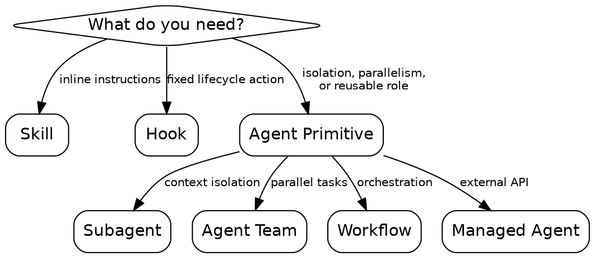
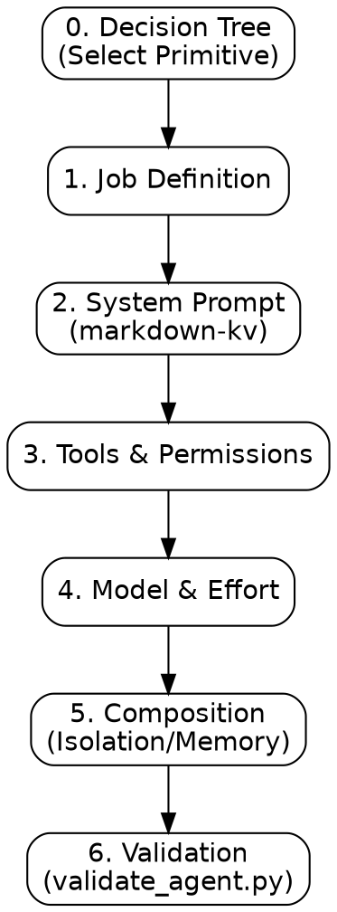

# create-agent

Agents are high-cost primitives. Use only for isolation, parallelism, or reusable roles. Use **skills** for inline instructions and **hooks** for fixed lifecycle actions.

## When to Use

## Process Flow

## 0. Decision Tree

**action: Select Primitive**
Analyze the requirement and confirm the primitive type via `AskUserQuestion`:

1. ✅ **Recommended** — [Subagent / Team / Workflow / Managed Agent] based on [isolation / parallelism / orchestration needs].
2. **Alternative** — [Alternative Primitive] + justification.
3. **Other** — [Skill / Hook] (redirect to appropriate skill).

## 1. Procedure: 7 Strict Decisions

1. **Job Definition:** "This agent <verb + object> so that <main-thread benefit>." (One sentence).
2. **Primitive Selection:** Subagent | Agent Team | Workflow | Managed Agent.
3. **System Prompt (markdown-kv):**
   - Read `references/system-prompt-craft.md` for instructions on writing effective agent prompts.
   - **Role:** Specific persona and single job.
   - **Objective:** Concrete measurable goal.
   - **Procedure:** Ordered imperative steps.
   - **Fallback:** Timeout/Dead-letter handling.
   - **Boundaries:** Explicit "Do Not" rules.
   - **Output:** Exact final message schema.
4. **Tools & Permissions:** Default to Read-only. Escalate to `Edit, Write, Bash` only if justified. Select permission mode: `default | plan | acceptEdits | bypassPermissions`.
5. **Model & Effort:**
   - Haiku (Classification/Dispatch)
   - Sonnet (Implementation/Orchestration)
   - Opus (Security/Deep Root-Cause)
6. **Composition:** Define `worktree` isolation, `skills: []` to preload, and `memory` scope.
7. **Validation:**
   - Run `validate_agent.py`.
   - Run `verification-before-completion`.
   - Ensure `description` has zero overlap with sibling skills.

**next skills:**

- `skill-builder`: To create formal eval sets and benchmark the agent's behavior across multiple runs before deployment.
- `verification-before-completion`: For initial manual verification of the agent's tool surface and output contract.

## Expert Patterns

- **Recursive Decomposition:** If prompt > 100 lines or >3 branches, split into a team/workflow.
- **Taint-Awareness:** Explicitly define "Untrusted Sources" and "Trusted Sinks".
- **Circuit Breakers:** Mandatory "Stop and Report" conditions for timeouts or tool failures.
- **State Handoff:** Define the "Context Payload" for workflows.

## Common Failure Modes

- **Context Bleed:** Too much irrelevant parent history. Use `worktree` and allowlists.
- **Tool Blindness:** Focus on "what" without tool "how". Add tool-specific steps to Procedure.
- **Infinite Loops:** Missing termination counters in multi-agent flows.
- **Permission Bloat:** Using `bypassPermissions` by default.
  s:\*\* Missing termination counters in multi-agent flows.
- **Permission Bloat:** Using `bypassPermissions` by default.
