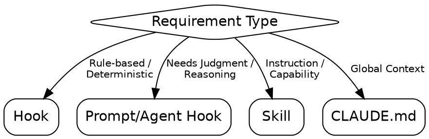
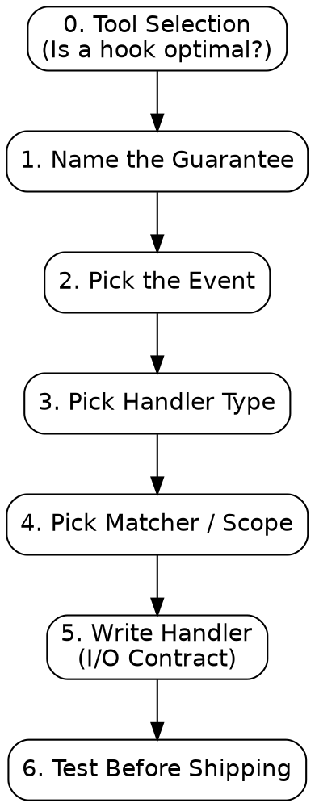

# create-hook

Transform a natural language requirement into a deterministic lifecycle hook. A hook trades latency for a **guarantee**: an action that occurs every time, instead of relying on model judgment.

## When to Use

## Process Flow

## 0. Tool Selection

**action: Evaluate Requirement**
Confirm if a hook is the optimal tool via `AskUserQuestion`:

1. ✅ **Recommended** — [Hook] based on [deterministic/rule-based trigger].
2. **Alternative** — [Prompt/Agent Hook] + reasoning for needing judgment.
3. **Other** — [Skill / CLAUDE.md] (redirect to appropriate tool).

## 1. Procedure: 7 Strict Decisions

1. **Name the Guarantee:** `When <trigger>, <action> MUST <result>`. (One sentence).
2. **Pick the Event:**
   - Read `references/events.md` completely to select the correct lifecycle event for the trigger.
3. **Pick Handler Type:** `command` (default), `http`, `prompt`, `agent`.
   - **Templates**: Reference `references/recipes.md` for implementation examples and hook "recipes."
4. **Pick Matcher (+ `if`):** Use narrowest regex and argument filters. Tool events only.
5. **Pick Scope:** `user | project (committed) | local (ignored) | plugin`.
6. **Write the Handler (I/O Contract):**
   - **Input:** Parse entire JSON from `stdin`.
   - **Decision:** Exit 2 (Block) + `stderr` OR Exit 0 + structured JSON.
   - **Logs:** Use `stderr` for diagnostics; `stdout` for JSON only.
7. **Test Before Shipping:** `echo '[SAMPLE_JSON]' | <handler_script>`. Verify exit code and output.

**next skills:**

- `verification-before-completion`: Once the hook is written, to manually exercise the event trigger and confirm the deterministic block or execution behavior.

## Expert Patterns

- **Infinite Loop Prevention:** `Stop` and `SubagentStop` hooks **MUST** check `stop_hook_active` and exit 0 immediately if true.
- **Async Side Effects:** Use `"async": true` for fire-and-forget logging/notifying. **NEVER** use for blocking.
- **Timeout Fallback:** Implement graceful fallbacks for scripts that invoke external processes or subagents.

## Implementation Rules

- **NEVER** set `async: true` on a hook that must block or return a decision.
- **NEVER** bypass input sanitization. Quote all shell variables.
- **NEVER** skip validation. Provide (1) settings JSON, (2) handler script, and (3) test command.
