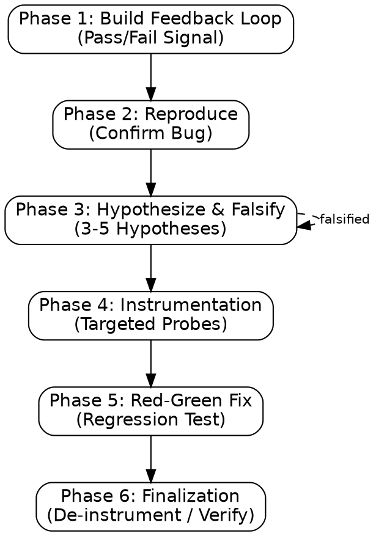

# diagnose

Identify true root cause through systematic falsification. **DO NOT GUESS.**

## Process Flow



**trigger:** debug, fix crash, unexpected behavior.
**constraint:** never apply multiple changes simultaneously. One hypothesis per run.
**constraint:** never modify original source directly. Use working copy.
**constraint:** never accept "works on my machine" as root cause.

## Phase 1: Build Feedback Loop

**action:** Create deterministic < 2s pass/fail signal.
**action:** Isolate filesystem, pin seeds/time. See `references/feedback-loops.md` for setup patterns by system type (CLI tools, API/HTTP services, and others).
**gate:** If no code execution, request logs/telemetry. Do not proceed without loop.

## Phase 2: Reproduce

**action:** Achieve >50% reproduction rate before hypothesis testing.
**gate:** Do not advance to Phase 3 without a logged reproduction rate. A root cause declared in Phase 3 without a confirmed repro signal here is not a diagnosis — it's a guess.

## Phase 3: Hypothesize & Falsify

**action: Present Hypotheses**
Read `references/phases.md` and propose 3-5 falsifiable hypotheses via `AskUserQuestion`. Surface the top 3 as real options (the tool caps at 4 and supplies a free-text "Other" automatically — never add one manually); log any remaining hypotheses in the session/diagnosis notes as queued, not dropped:

1. ✅ **Recommended** — [Primary Hypothesis] based on [Recent Changes > Logic > Env].
2. **Alternative** — [Second Hypothesis] + condition for testing.
3. **Alternative** — [Third Hypothesis] + condition for testing, if a third falsifiable candidate exists.

**format:** "If [X] is the cause, then [Y] will change when I do [Z]."
**dispatch:** If hypotheses are independent, use `multi-agent-dispatch`. Each hypothesis agent must be a **Writer with `isolation: worktree`** (not the read-only Investigator role) — instrumenting and running an experiment mutates a working copy, so each agent needs its own worktree. Disjoint by construction since each agent tests a different hypothesis.
**gate:** Do not declare a root cause until a hypothesis has been confirmed via Phase 4 instrumentation (a logged probe result that distinguishes it from the alternatives) — not by elimination-by-plausibility alone. If no hypothesis survives falsification, return to Phase 3 with new candidates rather than picking the "least falsified" one.

## Phase 4: Instrumentation

**action:** Instrument code dynamically at decision boundaries.
**format:** Prefix debug logs with `[DEBUG-XXXX]`.
**constraint:** Never "log everything." Use profilers (`time.perf_counter`) for perf issues.

## Phase 5: Red-Green Fix

**action:** Write regression test targeting failing seam **before** fix.
**action:** Confirm RED (test fails).
**action:** Apply minimal fix on working copy.
**action:** Confirm GREEN (test passes).
**action:** Run the N-1 test (see [`test-driven-development`](../test-driven-development/SKILL.md#n-1-test-false-green-elimination)) — revert the fix, confirm the regression test fails again, then restore the fix. A regression test written after the fix and never proven RED against the unfixed code is not evidence the bug is fixed.

## Phase 6: Finalization

**action:** Remove all `[DEBUG-XXXX]` tags.
**action:** Verify fix via Phase 1 loop.
**action:** Delete throwaway scripts or promote to test suite.

**next skills:**

- `test-driven-development`: To implement the verified fix if it involves new logic or refactoring.
- `refactor`: If the diagnosis reveals a structural "mess" that needs cleanup after the fix is verified.
- `planning`: If the bug reveals a major gap in the original specification or architecture.

## Transition

| Triggering Skill                 | Return Destination                                                       |
| :------------------------------- | :----------------------------------------------------------------------- |
| `verification-before-completion` | Re-verify in same skill                                                  |
| `test-driven-development`        | Current task/phase                                                       |
| `multi-agent-development`        | Current task/phase                                                       |
| `refactor`                       | Resume refactor cycle                                                    |
| `multi-agent-dispatch`           | INTEGRATE step (re-run validation once the conflict/regression is fixed) |
| `receive-code-review`            | Step 4 Implement (continue the severity-ordered fix loop)                |
| `codebase-init`                  | Failure Recovery step that invoked diagnose (resume Phase 1/2/3)         |
| `github-automation`              | The script/PR step that failed (resume once root cause is fixed)         |

## Output Format

```markdown
## Diagnosis Summary

**symptom:** [Description]
**root_cause:** [Correct Hypothesis]
**fix:** [Changes]
**feedback_loop:** [Reproduction Script]

## Post-Mortem

**prevention:** [Architecture/Test improvement]
**next_steps:** [Follow-up tasks]
```
