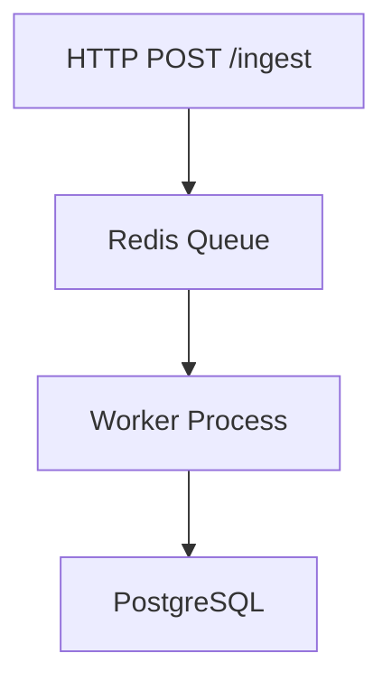
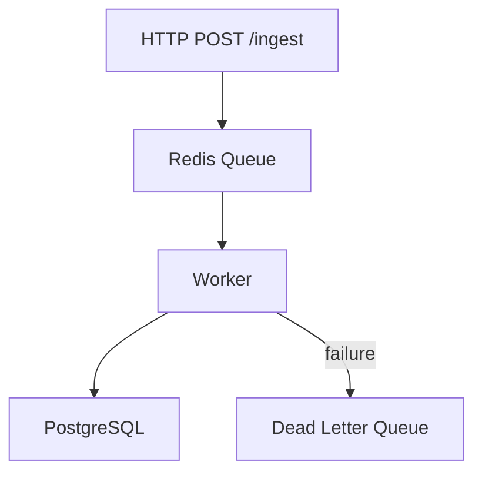

# Examples

## By Depth

### sketch — Exploratory

Light spec (Goal + top REQs), compact phases, no deep discovery.

**Spec excerpt (`auth-sketch.specs.md`):**

```markdown
# auth-sketch

## 1. Goal

- Enable users to authenticate with an email/password form.
- Completion signal: Users can log in and see their dashboard.

## 2. Requirements

- `REQ-001`: The form MUST accept email and password fields.
- `REQ-002`: Invalid credentials MUST display an error message.

## 4. Interfaces

- POST /auth/login — email + password in, JWT out
```

**Plan excerpt (`auth-sketch.plan.md`):**

```markdown
## PHASE-001: Implementation

### TASK-001: Implement REQ-001

Depends on: none
Files: [UNVERIFIED](UNVERIFIED)
Symbols: none
Satisfies: REQ-001
Action: Add email/password form component.
Validate: `npm test -- login.test.ts`
Expected result: Tests pass.
```

---

### contract — Build-ready (default)

Full 8-section spec with interface errors; atomic tasks with verified paths.

**Spec excerpt (`auth-jwt.specs.md`):**

```markdown
## 2. Requirements

- `REQ-001`: The system MUST issue a signed JWT on successful login.
- `SEC-001`: Tokens MUST expire after 3600 seconds.
- `PERF-001`: The login endpoint MUST respond within 200ms at p99.

## 4. Interfaces

The system exposes the following interfaces:

### POST /auth/login

**Input:** `email` (string, required), `password` (string, required)
**Output:** `{ token: string, expiresAt: ISO8601 }`
**Errors:** 400 (missing fields), 401 (invalid credentials), 500 (internal error)

## 6. Acceptance Criteria & Validation

- `AC-001`: A valid login request returns 200 with a JWT token.
- `VAL-001`: `npm test -- auth/login.test.ts`
```

**Plan excerpt (`auth-jwt.plan.md`):**

```markdown
### TASK-003: Implement token signing

Depends on: [TASK-002](#task-002-create-jwt-utilities)
Files: [src/auth/jwt.ts](src/auth/jwt.ts)
Symbols: [signToken](src/auth/jwt.ts#L24)
Satisfies: REQ-001, SEC-001
Action: Implement JWT signing using RS256 with 3600s expiry.
Validate: `npm test -- src/auth/jwt.test.ts`
Expected result: All 6 tests pass, 0 skipped.
```

---

### blueprint — Production-critical

All 8 sections + rollback strategy, Mermaid diagram, narrative runbook tasks.

**Extra spec sections:**

````markdown
## 8. Notes & Risks

- `RISK-001`: Redis restart may drop queued events — mitigation: enable AOF persistence.
- `NOTE-001`: PostgreSQL migration must run in a transaction; rollback on failure.


````

**Extra plan sections:**

```markdown
## PHASE-ROLLBACK: Rollback Procedures

### TASK-020: Rollback database migration

Depends on: none
Files: [migrations/002_add_events_table.sql](migrations/002_add_events_table.sql)
Symbols: none
Satisfies: NOTE-001
Action: Execute `psql -f migrations/rollback_002.sql` to drop the events table.
Validate: `psql -c "\\d events" 2>&1 | grep 'did not exist'`
Expected result: Command confirms table does not exist.
```

## By Domain

### Sketch Quick-Start

Minimal sketch-depth examples — 1 requirement + interface only, no Context/Examples/Notes sections.

**REST API (sketch):**

```markdown
## 2. Requirements

- `REQ-001`: The API MUST return the current user's profile as JSON on GET /me.

## 4. Interfaces

- GET /me — auth token in, `{ id, email }` out
```

**CLI tool (sketch):**

```markdown
## 2. Requirements

- `REQ-001`: The tool MUST print version info on `--version`.

## 4. Interfaces

- `mytool --version` — no input, prints `mytool vX.Y.Z` to stdout, exit 0
```

**DB schema (sketch):**

```markdown
## 2. Requirements

- `REQ-001`: The schema MUST add a `status` column to the `orders` table.

## 4. Interfaces

- `orders.status` — VARCHAR(20), NOT NULL, default `'pending'`
```

---

### REST API

Copy the patterns below directly into the spec's Requirements/Interfaces sections.

**Requirements pattern:**

```markdown
- `SEC-001`: All requests MUST include a valid Bearer token in the Authorization header.
- `REQ-001`: The API MUST return JSON for all successful and error responses.
- `PERF-001`: The endpoint MUST respond within 200ms at p99 under 100 RPS.
```

**Interface pattern (mandatory error cases):**

```markdown
### POST /api/v1/users

**Input:** `email` (string, required), `password` (string, required, min 8 chars)
**Output:** `{ id, email, createdAt }`
**Errors:**

- `400`: Missing required fields or invalid schema
- `401`: Unauthorized — missing or invalid Bearer token
- `409`: Conflict — email already registered
- `500`: Internal server error
```

**Constraint pattern:**

```markdown
- `CON-001`: The solution MUST NOT store passwords in plaintext.
- `CON-002`: The response payload MUST NOT exceed 64 KB.
```

---

### CLI Tool

Copy the patterns below directly into the spec's Requirements/Interfaces sections.

**Requirements pattern:**

```markdown
- `REQ-001`: The tool MUST support `--json` for machine-readable output.
- `REQ-002`: The tool MUST exit with a non-zero code on any failure.
- `COMP-001`: The tool MUST be compatible with POSIX-compliant shells (bash, zsh).
```

**Interface pattern:**

```markdown
### migrate run

**Input:** `[--dry-run] [--env staging|production]`
**Output:** Migration status (stdout), errors (stderr)
**Errors:**

- Exit 1: Database connection failure
- Exit 2: Migration file not found
- Exit 0: Success (all migrations applied)
```

---

### Database schema

**Requirements pattern:**

```markdown
- `REQ-001`: The schema MUST support soft-delete (deleted_at timestamp, nullable).
- `CON-001`: The solution MUST NOT alter the existing `users_legacy` table.
- `PERF-001`: All foreign-key lookups MUST be covered by an index.
```

**Interfaces (table definition):**

```markdown
### Table: events

| Column     | Type        | Constraints                            |
| ---------- | ----------- | -------------------------------------- |
| id         | UUID        | PRIMARY KEY, DEFAULT gen_random_uuid() |
| user_id    | UUID        | REFERENCES users(id) ON DELETE CASCADE |
| type       | VARCHAR(50) | NOT NULL                               |
| payload    | JSONB       | NOT NULL                               |
| created_at | TIMESTAMPTZ | NOT NULL DEFAULT now()                 |
| deleted_at | TIMESTAMPTZ | NULL                                   |
```

---

### Blueprint distributed system

For high-throughput pipelines, add to `Notes & Risks`:

````markdown
## 8. Notes & Risks

- `RISK-001`: Redis restart may drop queued events — mitigation: enable AOF persistence.
- `RISK-002`: PostgreSQL migration failure may leave schema in inconsistent state — mitigation: wrap in transaction, rollback on error.
- `NOTE-001`: Deploy worker process before enabling the HTTP ingest endpoint.


````
