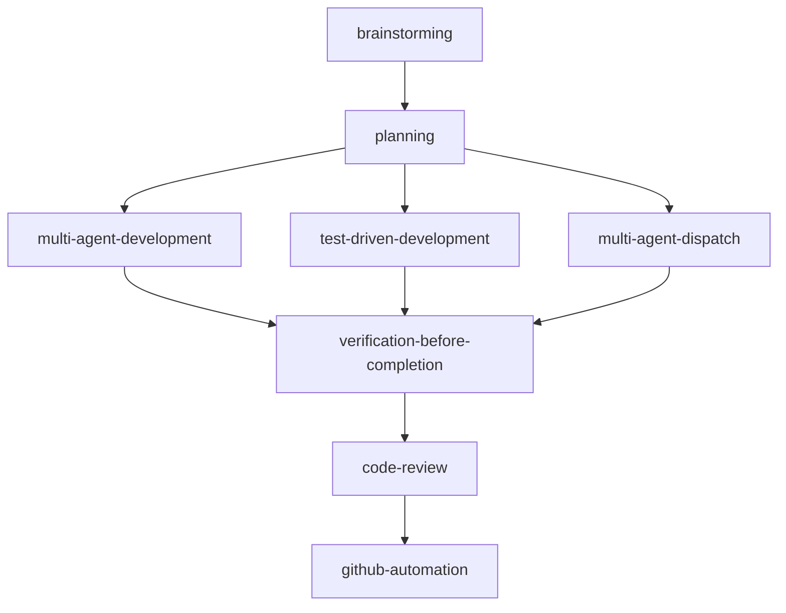

# using-agent-dev-skills

Global entry point for agent-dev plugin coordination. Follow this routing logic for ALL tasks.

## Rules

1. **Check Table First:** Evaluate before any action.
2. **Invoke Immediately:** If a signal matches, route to that skill.
3. **Notify:** Output one line: `Routing to \`<skill-name>\`: <reason>.`
4. **No Skips:** Do NOT skip because a task seems \"simple\" or \"quick\".

## Routing Table

| Signal                                               | Skill                            |
| :--------------------------------------------------- | :------------------------------- |
| \"build X\", \"new feature\", Ambiguous design       | `brainstorming`                  |
| \"write spec\", \"create plan\"                      | `planning`                       |
| Implementation, writing code, functions              | `test-driven-development` ⚠️     |
| \"broken\", \"debug\", Production error, Traceback   | `diagnose`                       |
| \"review this\", Before opening PR                   | `code-review`                    |
| \"clean up\", \"refactor\", \"simplify\"             | `refactor`                       |
| \"architecture review\", \"God class\", Coupled code | `architecture`                   |
| \"add hook\", \"auto-format\", Lifecycle guards      | `create-hook`                    |
| \"build agent\", \"subagent\", Agent prompt error    | `create-agent`                   |
| \"in parallel\", \"fan out\", 2+ independent tasks   | `multi-agent-dispatch`           |
| \"implement plan\", \"build all tasks\"              | `multi-agent-development`        |
| \"make skill\", \"skill not working\"                | `skill-builder`                  |
| \"add CI\", GitHub Actions, `gh` CLI                 | `github-automation`              |
| \"done\", \"ready to merge\"                         | `verification-before-completion` |
| \"update AGENTS.md\", \"onboard me\"                 | `agents-maintainer`              |

⚠️ **Agentic Skill Warning:** `test-driven-development` and `code-review` execute autonomously.
**Confirm:** Output `This will start an autonomous session (~N calls). Proceed?` and wait for user confirmation.

## Lifecycle Chain

## Quick-Start Gates

1. **No spec?** → `brainstorming` → `planning`
2. **Crash/Failure?** → `diagnose`
3. **Done?** → `verification-before-completion` → `code-review`
4. **Building Meta?** → `skill-builder` | `create-agent` | `create-hook`

## Skip Disclaimer

If a skill is missing: `The \`<skill-name>\` skill is not installed. Proceeding without it.` then apply intent manually.
