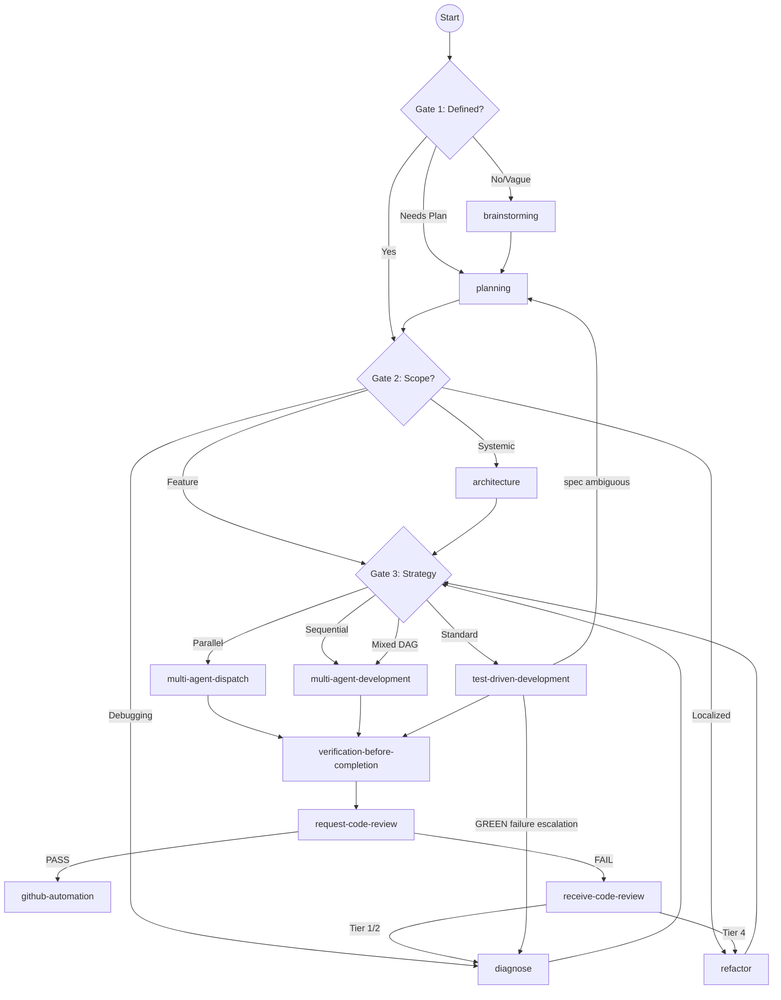

# Agent-Dev Lifecycle

## Lifecycle Chain

## Transition States

- **TDD Escalation:** If TDD fails to pass after 3 attempts, it must return to `diagnose` or `planning`.
- **Review Failure:** `receive-code-review` analyzes the failure level and routes back to the appropriate corrective skill.
